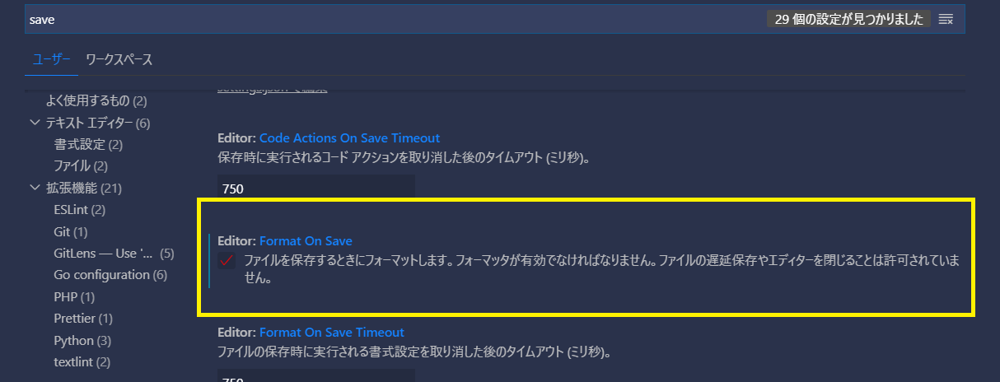

# NetReaderNeo

## 編集時の推奨環境
- エディター：vscode 

### vscodeのHTMLフォーマッタの設定

VS Codeの「ファイル保存するときのフォーマット」を有効にしてください。

[webhookによるマニュアル更新の仕組み](https://gist.github.com/ks-developer/2a40c4db0f90220cc6f93b1b1432d1cc)
